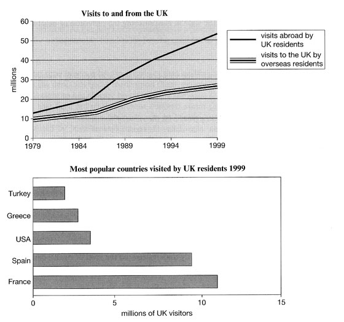
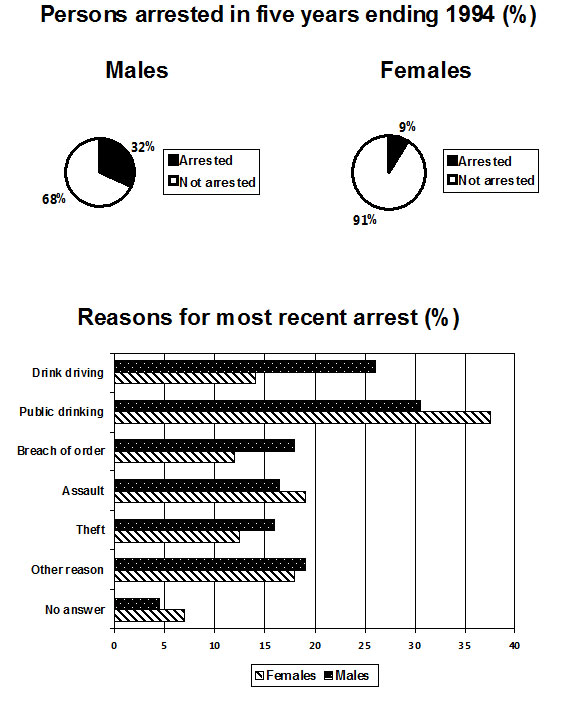
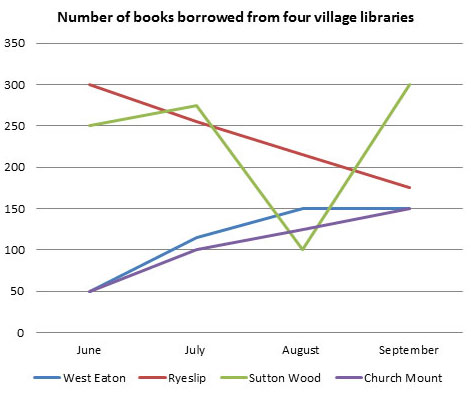
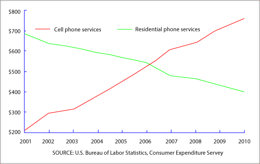

# GRAPHS

## Pie Chart

- Question

The pie chart shows the amount of money that a children's charity located in the USA spent and received in one year.

Summarize the information by selecting and reporting the main features and make comparisons where relevant.

- Answer

The pie charts show the amount of revenue and expenditures over a year of a children's charity in the USA. Overall, it can be seen that 
donated food accounted for the majority of the income, while programe services accounted for the most expenditure. Total revenue sources
just exceeded outgoings.

In detail, donated food provided most of the revenue for the charity, at 86%. Similarly, with regard to expenditures, one category, 
program services, accounted for nearly all of the outgoings, at 95.8%.

The other categories were much smaller. Community contributions, which were the second largest revenue source, brought in 10.4% of overall
income, and this was followed by program revenue, at 2.2%. Investment income, goverment grant, and other income were very small sources of 
revenue, account for only 0.8% combined.

There were only two other expenditure items, fundraising and management and general, accounting for 2.6% and 1.6% respectively. The total
amount of income was $53,5615,80, which was just enough to cover the expenditure of $53,224,896.

- Answer 1

The pie charts depict the yearly income and cost for a year of a children's charity, which is situated in the USA. Overall, the children's charity has exactly six receiving funds of sources and among them, the ultimate source is donated food whereas they spend their money in the three sectors and program service is the predominant cost of the charity.

While the charity largely cost on the program service and it is accurately 95.8%, they vastly get the receiving money as donated food and it is 86.6%, which is less than the highest cost. The second large income source is the community contribution, which is 10.4%; however, the second maximum cost is the fund rising and it is 2.6% of total cost.

Moreover, there are another four sources such as program revenue (2.2%), investment income (0.2%), government grants (0.2%), and other income(0.4%) from which the children's charity receive money and among them investment income (0.2%), and government grants (0.2%)are the lowest source. On the other hand, there is another source of the charity is management and general (1.6%) and it is the lowest expenditure of the charity. Furthermore, the total receiving fund is $53, 561,580 in a year and total money cost is $53,224,896 in a year.

## Line & Bar Chart

- Question

The line graph shows visits to and from the UK from 1979 to 1999, and the bar graph shows the most popular countries visited by UK 
residents in 1999

Summarize the information by selecting and reporting the main features and make comparisons where relevant.

The line graph illustrates the numbers of visitors in millions from the UK who went abroad and those that come to the UK between 1979 
and 1999, while the bar chart shows which countries were the most polular for UK residents to visit in 1999. Overall, it can be seen 
that visits to and form the UK increased. and that France was the most polular country to go to.

To begin, the number of visits abroad by UK residents was higer than for those that came to the UK, and this remained so throughout the 
period. The figures started at a similar amount, around 10 million, but visits abroad increased significantly to over 50 million, 
whereas the number of overseas residents rose steadily to reach just under 30 million.

By far the most popular country to visit in 1999 were France at approximately 11 million visitors, followed by Spain at 9 million. The 
USA, Greece and Turkey were far less popular at around 4,3 and 2 million visitors respectively

## Pie Chart

- Question

The pie chart shows the percentage of persons arrested in the five years ending 1994 and the bar chart shows the most recent reasons for 
arrest.

Summarize the information by selecting and reporting the main features and make comparisons where revelant.

- Answer

The pie chart illustrates the percentage of males and females who were arrested from 1989 to 1994, while the bar chart compares the main
reasons that the different genders were arrested most recently. It is evident from the charts that mals were arrested more than females 
and that public drinking was the most common reason for arrest for both.

To begin, the proportion of males arrested was much greater than for females. 32% were arrested compared to only 9% for women. Turning 
to the reasons for the most recent arrests. there were some clear differences between men and women. Men were twice as likely to be 
arrested for drink driving than women, at 26% and 14% respectively. Breach of order, theft, and other reasons were also slightly higher 
for men, with all these offences standing in the range of 12-18% for both sexes. Interestingly though, women experienced a higher 
percentage of arrest rates for assault and public drinking. The figures for assault were fairly similar at approximately 18%, whereas 
public drinking represented the main reason for arrest, with women at a massive 38%, compared to 31% for men.

## Line Grpah and Pie Chart

- Question

The line graph shows the number of books that were borrowed in four different months in 2014 from four village libraries, and the pie 
chart shows the percentage of books, by type, that were borrowed over this time.

Summarize the information by selecting and reporting the main features and make comparisons where revelant.

- Answer

The line graph depicts the numbers of books that were loaned out from four libraries over a four month period and the pie chart 
illustrates the proportions of books borrowed in terms of genre. It is immediately apparent that the borrowing patterns for each library
were quite varied, and that fiction was by far the most polular type of book.

The borrowing of books at Sutton Wood and Ryeslip began farily high, at 250 and 300 per month in June respectively. However, while book
borrowing at Ryeslip fell steadily to around 175 at the end of the period, borrowing at Sutton Wood folowed a much more erratic pattern.
It plummeted to 100 in August, before then rising steeply to finish at 300, which represented the highest level of borrowing of the four

Borowing at West Eaton and Church Mount, meanwhile, followed very similar patterns, with both starting quite low at 50 per month, but 
then gradually increasing to finish at 150.

Moving on to the type of books borrowed, fiction was in demand the most, at 43%. The next most popular books were biographies, accouting
for around a fifth of the total. The borrowing of science and histroy were indentical, at 14% each, leaving self-help as the least 
popular at 10%

## Line Grpah

- Question

The graph shows averange annual expenditures on cell phone and residential phone services between 2001 and 2010.

Summarize the information by selecting and reporting the main features, and make comparisons where relevant.

- Answer

The line graph illustrates the averange cost that American customers spent on mobile and landline phone services annually overy a 
10-year period.

Overall, spending on residential phone services dramatically declined, while polularity of mobile services increased sharply throughout
a decade. Also, both services met at the same record in 2006.

In 2001, spending on mobile phone services began by merely $200, while the amount of annual expenditure on the residential phone service
was around $700. Over the following five years, expenditure on landline phone services gradually dropped below $600, whereas expenditure
on cell phone services rose to just over $500.

In 2006 cell phones overtook landline phones, and the services became equal in polularity with customers' annual expenditure of about 
$550. Then, cell phone expenses rose to approximately $750 in 2010, making nearly a fourfold jump relatively to its initial figure in
2010. Meanwhile, spending on residential phone services experienced a steep fall in 2007 and went on to steadily decrease for the rest
of the period.

