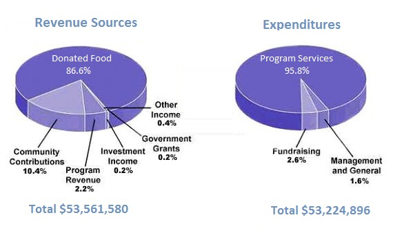

# GRAPHS

## Pie Chart

- Question

The pie chart shows the amount of money that a children's charity located in the USA spent and received in one year.

Summarize the information by selecting and reporting the main features and make comparisons where relevant.

- Answer

The pie charts show the amount of revenue and expenditures over a year of a children's charity in the USA. Overall, it can be seen that 
donated food accounted for the majority of the income, while programe services accounted for the most expenditure. Total revenue sources
just exceeded outgoings.

In detail, donated food provided most of the revenue for the charity, at 86%. Similarly, with regard to expenditures, one category, 
program services, accounted for nearly all of the outgoings, at 95.8%.

The other categories were much smaller. Community contributions, which were the second largest revenue source, brought in 10.4% of overall
income, and this was followed by program revenue, at 2.2%. Investment income, goverment grant, and other income were very small sources of 
revenue, account for only 0.8% combined.

There were only two other expenditure items, fundraising and management and general, accounting for 2.6% and 1.6% respectively. The total
amount of income was $53,5615,80, which was just enough to cover the expenditure of $53,224,896.

- Answer 1

The pie charts depict the yearly income and cost for a year of a children's charity, which is situated in the USA. Overall, the children's charity has exactly six receiving funds of sources and among them, the ultimate source is donated food whereas they spend their money in the three sectors and program service is the predominant cost of the charity.

While the charity largely cost on the program service and it is accurately 95.8%, they vastly get the receiving money as donated food and it is 86.6%, which is less than the highest cost. The second large income source is the community contribution, which is 10.4%; however, the second maximum cost is the fund rising and it is 2.6% of total cost.

Moreover, there are another four sources such as program revenue (2.2%), investment income (0.2%), government grants (0.2%), and other income(0.4%) from which the children's charity receive money and among them investment income (0.2%), and government grants (0.2%)are the lowest source. On the other hand, there is another source of the charity is management and general (1.6%) and it is the lowest expenditure of the charity. Furthermore, the total receiving fund is $53, 561,580 in a year and total money cost is $53,224,896 in a year.
